### INPUT VARIANTS ------------------------

### (Default)

The standard input field with no special features.

  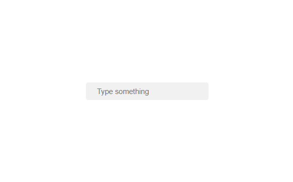

### (With visible password and icon)

Input field with a password toggle feature. Users can show or hide the password by clicking the icon.

  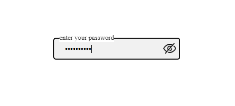

  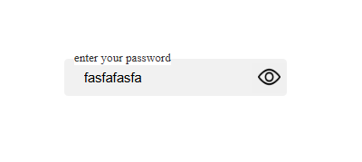

### (Clearable button)

Input field with a clear button, allowing users to quickly remove the text inside the input.

  

  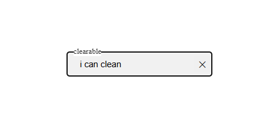

### (All variants)

Demonstrates all input field features together, including password visibility and clearable button.

  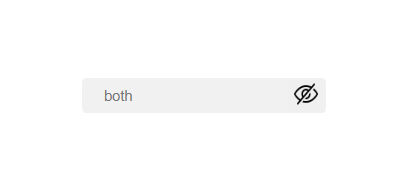

  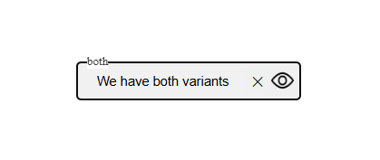

### TOAST VARIANTS ------------------------

### (Default)

A neutral info toast, used for general notifications.

  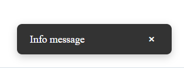

### (Success)

A green success toast, indicating a positive action or confirmation.

  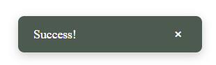

### (Error)

A red error toast, used to show failure or critical messages.

  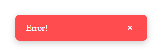

### SideBar VARIANTS ------------------------

### (Default)

The standard sidebar with a list of items.

  

  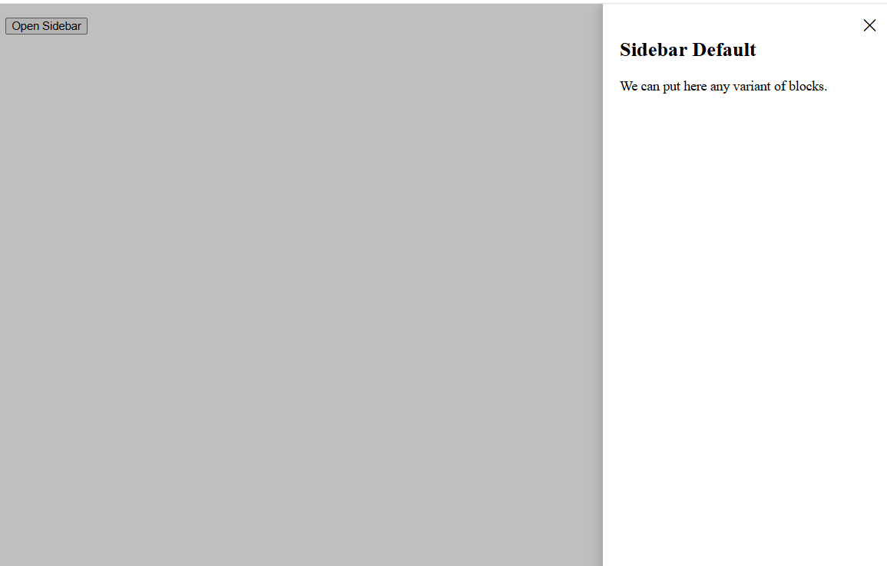

### Simple accordion( 1 lvl nested)

Sidebar with a single-level nested accordion. Items can expand/collapse to show sub-items.

  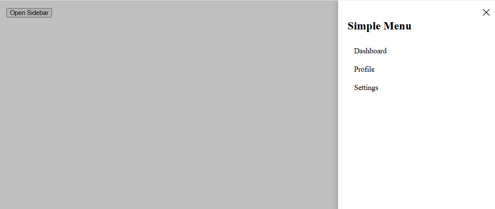

### Nested accordion( 2 lvl nested)

Sidebar with a two-level nested accordion. Useful for hierarchical navigation.

  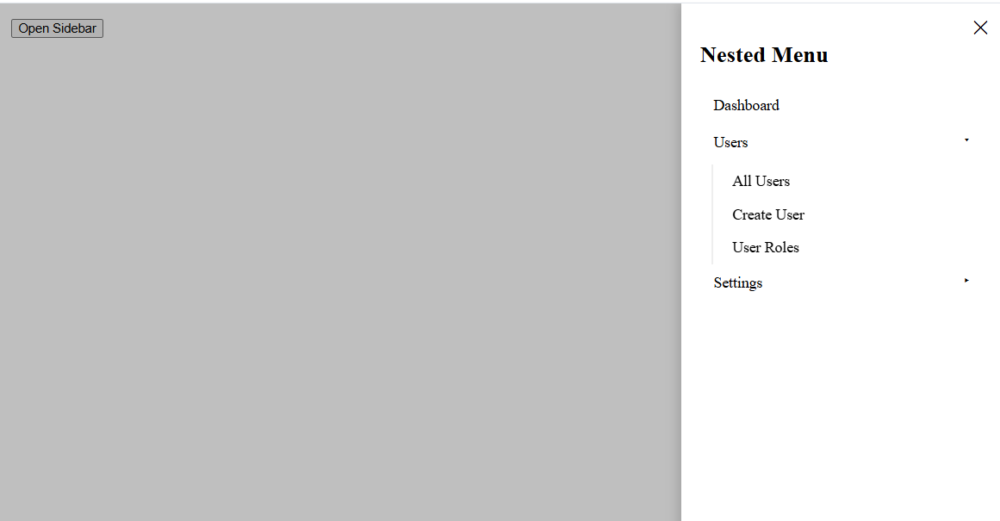

